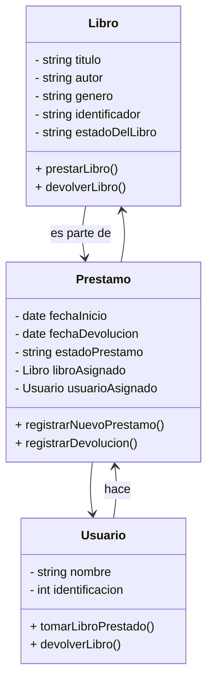
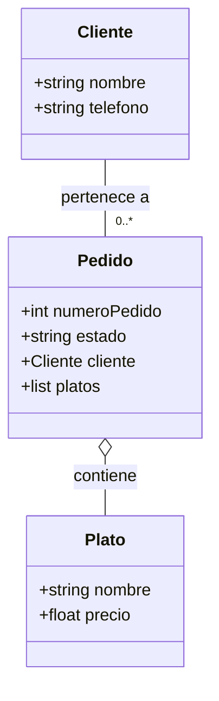
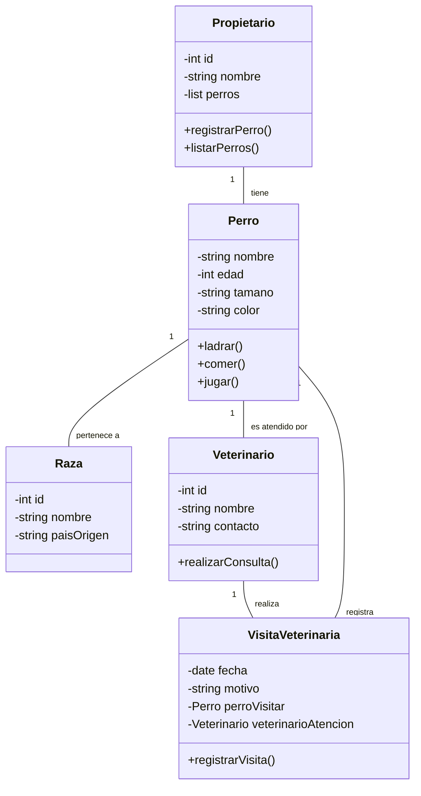

## 1

```mermaid
classDiagram
    class Libro {
        - string titulo
        - string autor
        - string genero
        - string identificador
        - string estadoDelLibro
        + prestarLibro()
        + devolverLibro()
    }
    
    class Usuario {
        - string nombre
        - int identificacion
        + tomarLibroPrestado()
        + devolverLibro()
    }
    
    class Prestamo {
        - date fechaInicio
        - date fechaDevolucion
        - string estadoPrestamo
        - Libro libroAsignado
        - Usuario usuarioAsignado
        + registrarNuevoPrestamo()
        + registrarDevolucion()
    }

    Usuario --> Prestamo : hace
    Libro --> Prestamo : es parte de
    Prestamo --> Libro
    Prestamo --> Usuario

```
## 2

```mermaid 
classDiagram
    class Pedido {
        +int numeroPedido
        +string estado
        +Cliente cliente
        +list platos
    }
    class Plato {
        +string nombre
        +float precio
    }
    class Cliente {
        +string nombre
        +string telefono
    }

    Cliente  -- "0..*" Pedido : pertenece a
    Pedido  o-- Plato : contiene

```

## 3

```mermaid
classDiagram
   class Propietario {
      -int id
      -string nombre
      -list perros
      +registrarPerro()
      +listarPerros()
   }
   class Perro {
      -string nombre
      -int edad
      -string tamano
      -string color
      +ladrar()
      +comer()
      +jugar()
   }
   class Raza {
      -int id
      -string nombre
      -string paisOrigen
   }
   class Veterinario {
      -int id
      -string nombre
      -string contacto
      +realizarConsulta()
   }
   class VisitaVeterinaria {
      -date fecha
      -string motivo
      -Perro perroVisitar
      -Veterinario veterinarioAtencion
      +registrarVisita()
   }

   Propietario "1" -- "tiene " Perro
   Perro "1" -- "pertenece a " Raza
   Perro "1" -- "es atendido por " Veterinario
   Veterinario "1" -- "realiza " VisitaVeterinaria
   Perro "1" -- "registra " VisitaVeterinaria
```

